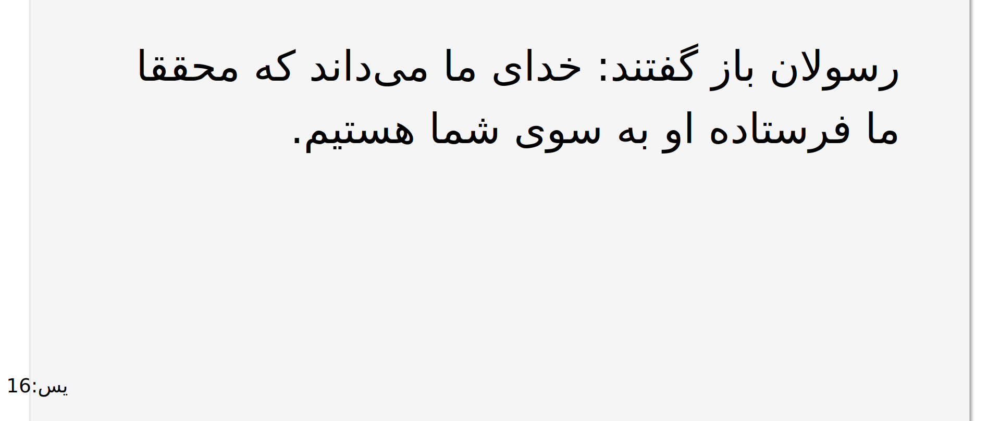

# Qurandom

### on reload shows a random verse of the <a href="https://en.wikipedia.org/wiki/Quran" target="_blank">Holy Quran</a>📖🕋




### the parser is written with the least dependencies needed for ease of usage

<br/>

## How to Run

how to run the server

```cmd
❯ python3 app.py
INFO:__main__:Started server process [151760]
INFO:waitress:Serving on http://0.0.0.0:8080
```

## TODO

- [ ] enhance the UI
- [ ] use a built in module instead of requests
